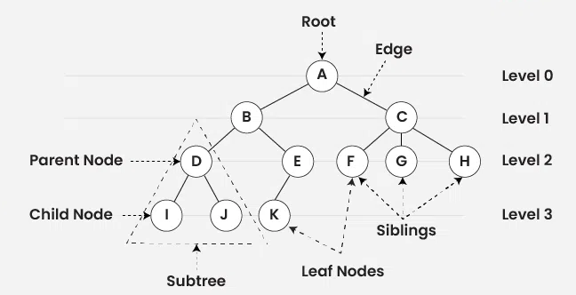
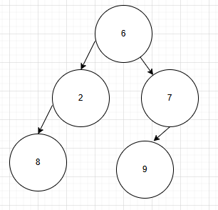
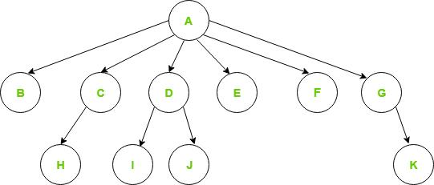
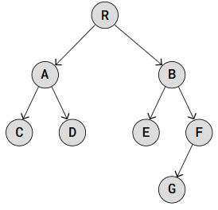

# Trees

* It is a non-linear data structure

## Tree type:
 * Binary Tree
 * Binary Search Tree
 * Balanced Tree ( AVL, Red flag Tree)
 * Trie Tree (used in next character prediction in google search engine)

## Terminologies

**Node** : container to hold data and links to another node
**RootNode** : node with no parent
**Children** : node which has parent
**Edge** : connection between nodes
**LeafNode** : last node which has no children
**height** : Maximum number of edges from root node to leaf node + 1
**Treesize** : No of nodes in the tree



## Traversals
1. PreOrder  -> Root Left Right
    * It is a type of **Depth first Search**.
    * This traversal is "pre" order because the node is visited "before" the recursive pre-order traversal of the left and right subtrees.
2. InOrder  -> Left Root Right
3. PostOrder -> Left Right Root


pre : 6,2,8,7,9
in : 8,2,6,9,7
post : 8,2,9,7,6


## N-array Tree
* In a tree, if a parent has n number of children, then that tree is called N-array tree



## Binary Tree
* Every parent has maximum of only 2 children


## Binary Search Tree (BST)
* Same contraint of Binary tree.
* Also the left child value is lower and right child value is greater than root value.


### Important Observations
* All the nodes are **unique** in BST.
* When we apply **inorder traversal** in BST it will results in **Sorting - ASC to DECS**.
* We can also use this inorder traversal to check whether it is BST or not.
* On preorder traversal the position of root node is at **first**.
* On postorder traversal the position of root node is at **last**.
* On inorder the position of root node is on **middle if odd length**, otherwise **(n/2)+1 if even**.
* Searching in BST results in lower time complexity
```
public boolean searchOnBST(TreeNode head, int target){
        TreeNode node = head;
        System.out.println("Node : "+node.data);
        if(node == null){
            return false;
        }
        else{
            if(node.data == target) {
                return true;
            }
            else if ( target < node.data) {
                return searchOnBST(node.left, target);
            }
            else{
                return searchOnBST(node.right, target);
            }
        }

    }

```
* finding the size of the tree
```
public int sizeOfTree(TreeNode head)throws NullPointerException{
        TreeNode node = head;
        if(node == null){
            return 0;
        }
        else{
            System.out.println("Node in size : "+node.data);
            return 1 + sizeOfTree(node.left) + sizeOfTree(node.right);
        }
    }
```

* Find the height of the tree [int height(Node head)]